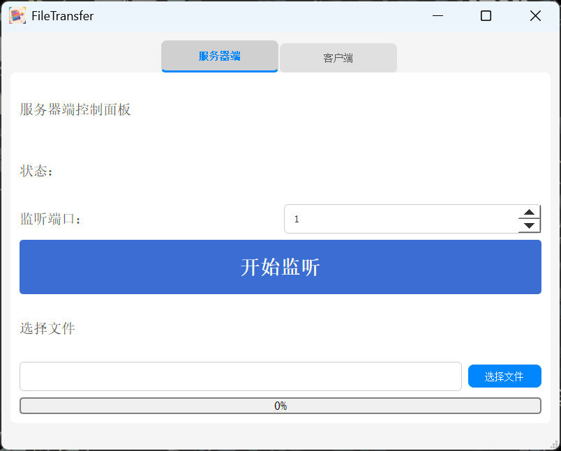
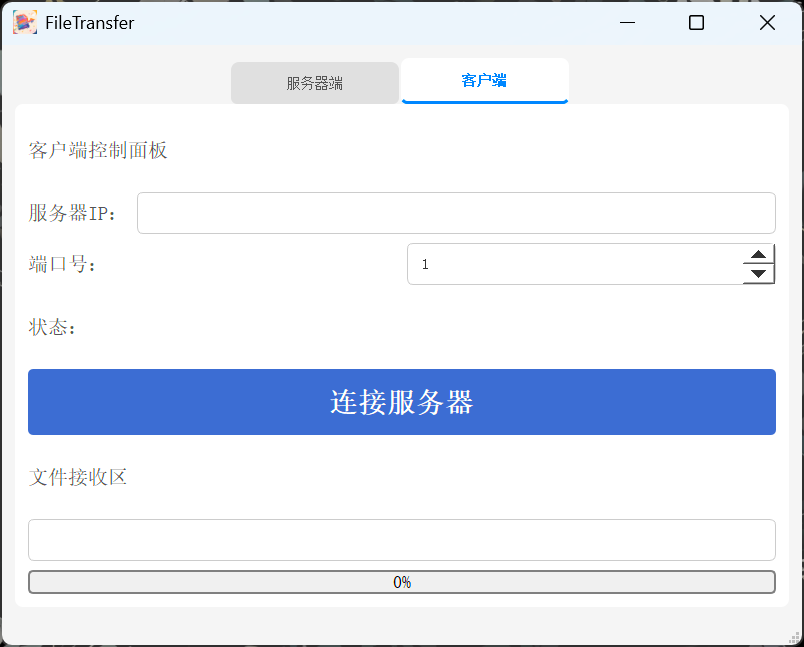

# 基于Qt和Socket编程的文件传输程序


## 项目简介
本项目是一个基于Qt和Socket编程的文件传输程序，通过使用Qt的网络编程库和Socket技术，实现了文件在客户端和服务器之间的高效、稳定传输。该程序适用于需要进行文件共享和传输的场景，如局域网内的文件分发、远程文件的获取等。

## 功能特点
- **高效传输**：采用TCP协议进行文件传输，确保数据的可靠传输，同时优化传输算法，提高传输效率。
- **易用性强**：提供简洁直观的用户界面，用户可以方便地选择要发送的文件和接收文件的保存路径。
- **扩展性好**：支持多文件同时传输，并且可以根据需要扩展功能，如添加文件加密、断点续传等。

## 安装步骤
### 环境依赖
- Qt开发环境（建议使用Qt 5.x及以上版本）
- C++编译器（如GCC、MSVC等）

### 编译和运行
1. 克隆项目到本地：
```bash
https://github.com/your-project.git
```
2. 打开Qt Creator，加载项目文件（.pro）。
3. 配置编译器和构建套件。
4. 编译并运行项目。

## 使用方法
### 服务器端
1. 启动服务器程序。
2. 等待客户端连接。
3. 选择要发送的文件，点击“发送”按钮。

### 客户端
1. 启动客户端程序。
2. 输入服务器的IP地址和端口号，点击“连接”按钮。
3. 选择接收文件的保存路径。
4. 等待文件传输完成。

## 示例与截图
### 服务器端界面


### 客户端界面


## 贡献指南
如果您对本项目感兴趣，并希望为其做出贡献，请遵循以下步骤：
1. Fork本项目。
2. 创建一个新分支：`git checkout -b feature-branch`。
3. 提交代码：`git commit -m "Add new feature"`。
4. 推送到分支：`git push origin feature-branch`。
5. 发起Pull Request。

## 许可证信息
本项目采用MIT许可证，详情请参考 [LICENSE 文件](./LICENSE)。